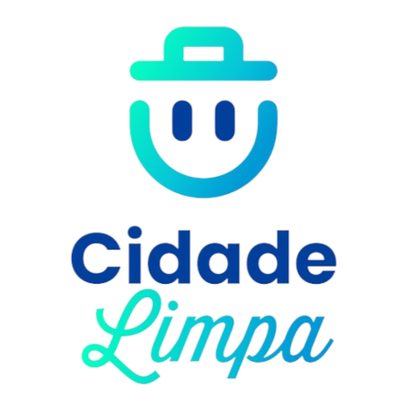
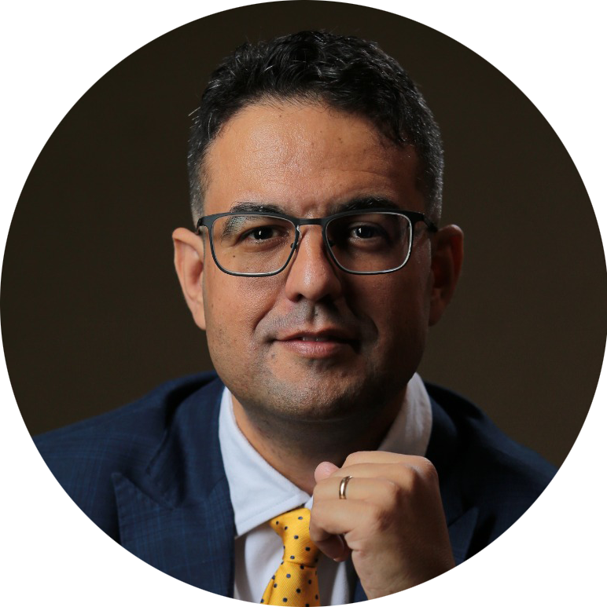

<h2 align='center'>Cidade Limpa</h2>

Aplicativo proposto como atividade para a <b>FIAP</b> envolvendo um sistema de coleta de lixo inteligente integrada e eficiente, envolvendo lixeiras inteligentes.

 

---

 

# Criadores

## Adriano Lombardi

adriano.lombardi@yahoo.com.br

[Linkedin](http://linkedin.com/in/adriano-lombardi-a21a3719)

 

## Alberto Frigatto de Andrade Ferreira

albertofrigatto.comercial@gmail.com

[Linkedin](https://www.linkedin.com/in/alberto-frigatto-de-andrade-ferreira-a72022251/)

[GitHub](https://github.com/Alberto-Frigatto)

 

## Danilo Fernando de Paula e Silva

danilo.bossanova@hotmail.com

[Linkedin](https://www.linkedin.com/in/danilo-fernando-3a4a49212/)

[GitHub](https://github.com/danilobossanova)

 

## Gustavo Rodrigues Lopes

guhrlopes999@gmail.com

[Instagram](https://www.instagram.com/gustavo.r.lopes/)

 

## Renato Luís Souza Brandão Júnior

renatojr_designer@outlook.com
